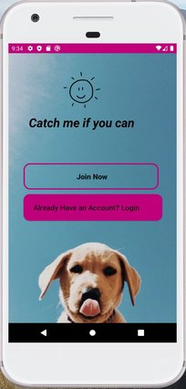

# Android Application - "GetPet"

General:
GetPet application is an animal adoption android application uses AndroidStudio and Firebase.
This uses Kaggle adoption data-set with 1000 animals images.
The app is based on basic android method that use in ecommerce apps.

### Here's image of our Main Activity:

