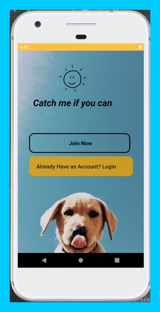
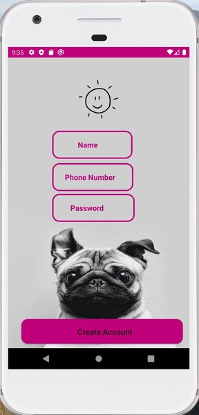
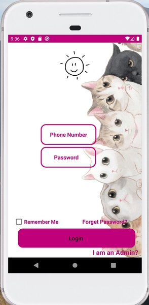
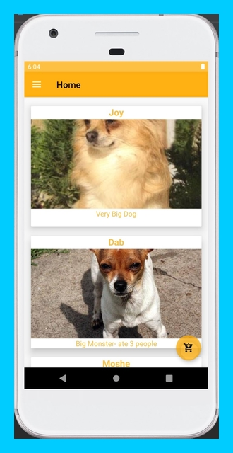
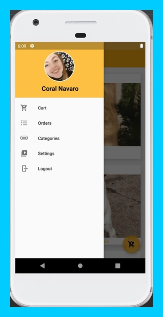

# Android Application - "GetPet"

General:
GetPet application is an animal adoption android application uses AndroidStudio and Firebase.
This uses Kaggle adoption data-set with 1000 animals images.
The app is based on basic android method that use in ecommerce apps.

### Here's image of our Main Activity:

### Here's image of our Register Activity:
Very simple UI give the user a quick way to navigate through different components in the app without big technological knowledge.
If it is your first time – then you nee to sign up with “Join now” button.
It will lead you to the next window:

### Here's image of our Login Activity:
If you have already an acocount you just need log in:

### And now i will show you the home page:
You can scroll and choose your favorite pet...

### Here is the Nav Bar:

....here i will add the rest of pics....
